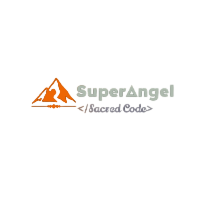
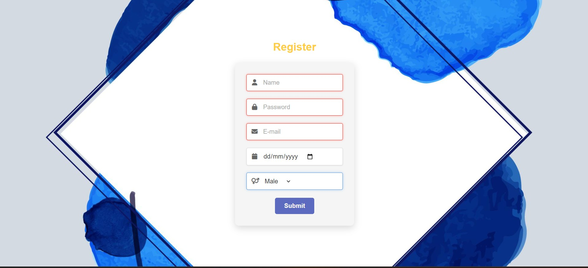

# Supranjal Khadka | Personal Portfolio

<div align="center">
  
  <br>
  <a href="https://supranjalkhadka.com.np">
    
  </a>
</div>

## 📋 Overview

Welcome to my personal portfolio repository! This site showcases my skills, projects, and journey as a Full Stack developer. Built with modern web technologies and following best practices for performance, accessibility, and SEO.

### ✨ Live Demo

Visit my portfolio: [supranjalkhadka.com.np](https://supranjalkhadka.com.np)

## 💻 Tech Stack

- **HTML5** - Semantic markup structure
- **CSS3** - Modern styling with Flexbox and CSS Grid
- **JavaScript** - Interactive elements and animations
- **Git** - Version control and deployment workflow

## 🚀 Projects

### Minimalist Form


A clean, responsive form interface built with accessibility in mind.

- **Technologies**: HTML, CSS (Flexbox)
- **Features**: Minimalist design, form validation, responsive layout
- [View Project](https://supranjalkhadka.com.np/projects/Form/)

### Hotel Landing Page


An elegant landing page for a luxury hotel with modern design elements.

- **Technologies**: HTML, CSS, Bootstrap
- **Features**: Responsive design, interactive elements, optimized images
- [View Project](https://supranjalkhadka.com.np/projects/Hotel/)

## 🛠️ Development

### Prerequisites
- Any modern web browser
- Code editor (VS Code recommended)
- Basic knowledge of HTML/CSS/JS

### Setup
```bash
# Clone the repository
git clone https://github.com/supranjal/portfolio.git

# Navigate to the project
cd portfolio

# Initialize submodules (for project demos)
git submodule update --init --recursive
```

## 📱 Contact

<div>
  <a href="mailto:supranjal777@gmail.com">
    
  </a>
  <a href="https://github.com/supranjal">
    
  </a>
  <a href="https://www.linkedin.com/in/supranjal-khadka-8bba52299/">
    
  </a>
  <a href="https://www.instagram.com/superangel699/">
    
  </a>
  <a href="https://x.com/dreadx77">
    
  </a>
</div>

## 📄 License

© 2025 Supranjal Khadka. All rights reserved.

---

<div align="center">
  <p><i>"Shaping ideas into code"</i></p>
</div>
